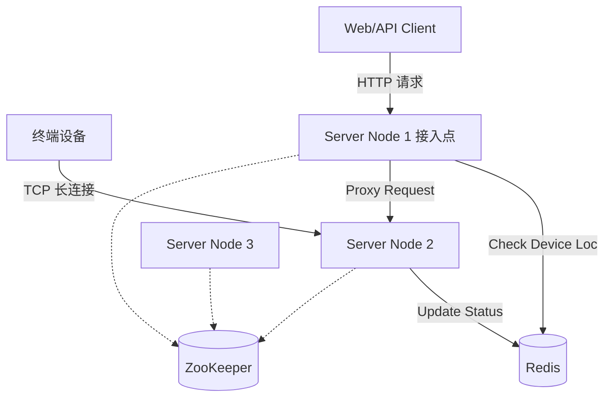

# 分布式服务器设计与部署方案

## 1. 整体架构设计 (Distributed Architecture)
```sh
sudo apt install libhiredis-dev
sudo apt-get install redis-server zookeeperd
sudo service redis-server start
sudo service zookeeper start

./httpserver \
  -p 52487 \
  -w 8080 \
  -z 127.0.0.1:2181 \
  -r 127.0.0.1:6379 \
  -i 172.17.0.1
```

本项目已从单机架构重构为支持多节点部署的分布式系统，主要组件包括：

*   **Gateway Server Node**: 核心业务服务器，负责处理设备长连接 (TCP) 和 HTTP 业务请求。
*   **ZooKeeper (Service Discovery)**: 负责服务注册与发现。所有节点启动时向 ZK 注册自己的 IP 和端口。
*   **Redis (Session Storage)**: 负责设备会话管理。存储设备 ID 与具体服务器节点的映射关系，实现无状态路由。

### 1.1 系统组件交互


### 1.2 关键流程

#### A. 服务注册 (Service Registration)
*   **组件**: `ZkClient`, `ServerApp`
*   **流程**: 服务器启动时，连接 ZooKeeper，在 `/gw-server/nodes/` 路径下创建 **临时节点 (Ephemeral Node)**。
*   **数据**: 节点包含 JSON 数据 `{"ip": "x.x.x.x", "port": 52487, "http_port": 8080}`。
*   **目的**: 实现集群监控，若节点宕机，临时节点自动消失。

#### B. 设备上线与状态同步 (State Sync)
*   **组件**: `HandleHeartbeat` (in `recvfile.cpp`)
*   **流程**: 设备发送心跳包 -> 服务器接收 -> 写入/更新 Redis。
*   **Key**: `device:online:<DeviceID>`
*   **Value**: `{"ip": "NodeIP", "port": TCP_Port, "http_port": HTTP_Port}`
*   **TTL**: 60秒 (心跳间隔需小于此值，确保状态活跃)。

#### C. 请求路由与代理 (Request Proxying)
*   **组件**: `http_server.cpp`
*   **场景**: 用户向 **Node 1** 请求控制 **设备 A**，但设备 A 连接在 **Node 2**。
*   **流程**:
    1.  Node 1 接收 HTTP 请求。
    2.  检查本地连接管理器 (`connection_manager`)，未找到设备 A。
    3.  查询 Redis `device:online:DeviceA`。
    4.  获取目标节点信息 (IP: Node2_IP, Port: Node2_HTTP_Port)。
    5.  Node 1 构造 HTTP 请求转发给 Node 2 (`httplib::Client`).
    6.  Node 2 处理请求并返回结果给 Node 1。
    7.  Node 1 将结果返回给用户。

---

## 2. 部署方案：从单机多端口到多机部署

目前测试环境是在 **单台服务器** 上开启 **3 个不同端口** 模拟 3 个节点。未来迁移到 **3 台独立服务器** 部署时，修改方案如下：

### 2.1 基础设施准备
确保每台服务器都能访问到 Redis 和 ZooKeeper。
*   **Redis**: 推荐部署 Cluster 或主从 Sentinel 模式，提供统一的访问 VIP。
*   **ZooKeeper**: 部署 3 节点 ZK 集群。

### 2.2 启动参数修改

无需修改代码，只需调整启动参数。假设有三台服务器 IP 分别为 `192.168.1.101`, `.102`, `.103`。

**Server A (192.168.1.101)**
```bash
./bin/httpserver \
  -p 52487 \           # TCP端口 (保持标准端口)
  -w 8080 \            # HTTP端口
  -z 192.168.1.200:2181 \  # ZK地址
  -r 192.168.1.200:6379 \  # Redis地址
  -i 192.168.1.101         # 本机外网/内网IP (重要：用于其他节点回调)
```

**Server B (192.168.1.102)**
```bash
./bin/httpserver \
  -p 52487 \           # 端口可以一样，因为IP不同
  -w 8080 \
  -z 192.168.1.200:2181 \
  -r 192.168.1.200:6379 \
  -i 192.168.1.102
```

### 2.3 负载均衡建议
在 3 台 Node 前面部署一个 **Nginx** 或 **LVS** 负载均衡器，负责分发 HTTP 请求。
*   **Client 连接**: 设备可以直接连接 LVS 的 TCP Port，LVS 轮询转发给后端节点。
*   **HTTP 请求**: 用户访问 LVS 的 HTTP Port，LVS 随机转发。如果转发到了错误的节点，该节点会自动 Proxy 到正确节点（基于我们实现的逻辑）。

---

## 3. 代码修改点索引

| 功能 | 文件 | 修改内容 |
| :--- | :--- | :--- |
| **基础设施** | `server/CMakeLists.txt` | 增加 `hiredis`, `zookeeper` 库链接 |
| **ZK 客户端** | `server/src/ZkClient.cpp` | 封装 ZooKeeper C API，实现连接、节点创建 |
| **Redis 客户端** | `server/src/RedisClient.cpp` | 封装 Hiredis，实现 Set/Get/Del 及其超时控制 |
| **服务器核心** | `server/src/ServerApp.cpp` | 集成 ZK/Redis 初始化，启动时注册 ZK 节点 |
| **服务器核心** | `server/inc/ServerApp.h` | 增加 ZK/Redis 成员变量及单例访问接口 |
| **启动入口** | `server/src/main.cpp` | 增加 getopt 参数解析 (`-p`, `-w`, `-z`, `-r`, `-i`) |
| **业务逻辑** | `server/src/recvfile.cpp` | `HandleHeartbeat` 中增加 Redis 写入设备在线状态 |
| **HTTP 接口** | `server/src/http_server.cpp` | 增加 Redis 查询及 HTTP 反向代理 (Proxy) 逻辑 |
