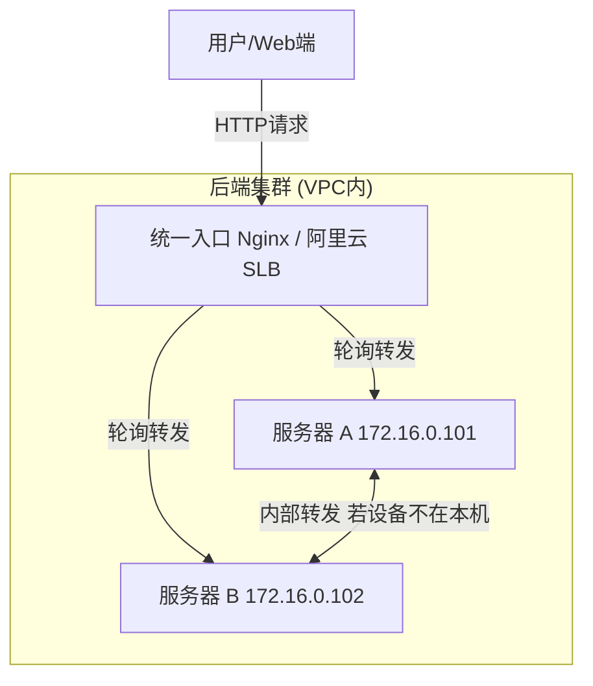

# 分布式部署与 Nginx 负载均衡方案 (Aliyun 部署指南)

## 1. Nginx 负载均衡策略

### 为了回答你的问题：
> "是不是要统一找一个前端 Nginx 转发负载均衡器，还是说有其他办法？"

**答案是：是的，你需要一个统一的入口。**

在分布式架构中，虽然每个节点都有处理能力，但客户端（Web 浏览器或 API 调用者）通常只需要一个统一的访问地址（域名或 VIP）。

### 推荐架构：统一入口 (Layer 7 Load Balancer)



### 为什么这样做？
1.  **应用层路由已就绪**: 我们的 C++ Server 已经实现了 **Smart Proxy**。无论 Nginx 把请求发给 Node A 还是 Node B，如果设备不在该节点，Server 会自动去 Redis 查并转发给正确的节点。
2.  **Nginx 配置简单**: 因此，Nginx 只需要配置最简单的 **轮询 (Round Robin)** 即可，不需要复杂的 hash 策略。

### Nginx 配置示例 (nginx.conf)
```nginx
upstream backend_servers {
    # 阿里云内网IP
    server 172.16.0.101:8080;
    server 172.16.0.102:8080;
}

server {
    listen 80;
    server_name api.yourdomain.com;

    location / {
        proxy_pass http://backend_servers;
        proxy_set_header Host $host;
        proxy_set_header X-Real-IP $remote_addr;
    }
}
```

---

## 2. 阿里云两节点完整部署方案

假设你有两台阿里云 ECS 实例，我们将它们配置为分布式集群。

### 2.1 服务器规划
| 角色 | 主机名 | 内网 IP (VPC) | 公网 IP | 运行服务 | 开放端口 (安全组) |
| :--- | :--- | :--- | :--- | :--- | :--- |
| **主节点** | ECS-A | `172.16.0.101` | `1.1.1.1` | HTTPServer, **Redis, ZK**, Nginx | TCP:52487, HTTP:80, 8080, 6379, 2181 |
| **从节点** | ECS-B | `172.16.0.102` | `2.2.2.2` | HTTPServer | TCP:52487, HTTP:8080 |

*(注：生产环境建议 Redis/ZK 独立部署或使用阿里云云数据库，但在两台机器的测试方案中，我们将基础服务部署在 ECS-A 上)*

### 2.2 环境准备与配置 (Step-by-Step)

#### 第一步：安全组配置 (阿里云控制台)
确保两台机器的 **安全组 (Security Group)** 规则允许互相访问。
*   **ECS-A 入方向**: 允许 ECS-B 的内网 IP 访问所有端口 (或者至少 6379, 2181, 8080)。允许公网访问 80, 52487。
*   **ECS-B 入方向**: 允许 ECS-A 的内网 IP 访问 8080。允许公网访问 52487。

#### 第二步：在 ECS-A 上启动基础服务
由于 ECS-A 是主节点，我们需要在这里运行 Redis 和 ZooKeeper。
```bash
# 1. 启动 Redis (确保绑定了 0.0.0.0 或者 内网IP，不要只 bind 127.0.0.1)
redis-server --bind 0.0.0.0 --daemonize yes

# 2. 启动 ZooKeeper
./bin/zkServer.sh start
```

#### 第三步：启动 ECS-A 上的 Gateway Server
我们在 ECS-A 上启动第一个节点。注意 `-i` 参数必须是**内网 IP**，这样 ECS-B 才能通过内网访问到它。

```bash
# 在 ECS-A (172.16.0.101) 上执行
./bin/httpserver \
  -p 52487 \                  # 设备接入端口
  -w 8080 \                   # 内部 HTTP 端口
  -z 127.0.0.1:2181 \         # 本机 ZK
  -r 127.0.0.1:6379 \         # 本机 Redis
  -i 172.16.0.101             # 【关键】注册本机内网IP
```

#### 第四步：启动 ECS-B 上的 Gateway Server
在 ECS-B 上启动第二个节点。它需要连接到 ECS-A 的 Redis 和 ZK。

```bash
# 在 ECS-B (172.16.0.102) 上执行
./bin/httpserver \
  -p 52487 \                  # 端口可以与 A 一样
  -w 8080 \
  -z 172.16.0.101:2181 \      # 指向 ECS-A 的 ZK
  -r 172.16.0.101:6379 \      # 指向 ECS-A 的 Redis
  -i 172.16.0.102             # 【关键】注册本机内网IP
```

---

## 3. 三节点扩容方案 (Clarification: 并非主从架构)

你提到 “目前两个节点相当于一主多从了”，这其实是一个 **误解**。

*   **业务逻辑是对等的 (Peer-to-Peer)**: Node A 和 Node B 运行的代码完全一样，地位平等。
*   **资源依赖**: 只是因为为了节省成本，我们把 **基础设施 (Redis/ZK)** 放在了 Node A 上。如果由阿里云提供 Redis/ZK 云服务，那么 Node A, B, C 就完全平等了。

### 3.1 三节点拓扑图
假设增加第三台机器 ECS-C (`172.16.0.103`)。
*   **Redis/ZK**: 依然运行在 ECS-A (`172.16.0.101`)。
*   **Gateway Servers**: 运行在 A, B, C 三台机器上。

### 3.2 启动配置
所有节点都连接 **同一个 Redis 和 ZK** (即 ECS-A 的 IP)。

**Node A (基础服务 + 业务节点)**
```bash
# 务必先启动 Local Redis & ZK
./bin/httpserver -p 52487 -w 8080 -z 127.0.0.1:2181 -r 127.0.0.1:6379 -i 172.16.0.101
```

**Node B (业务节点)**
```bash
./bin/httpserver -p 52487 -w 8080 -z 172.16.0.101:2181 -r 172.16.0.101:6379 -i 172.16.0.102
```

**Node C (新增业务节点)**
```bash
./bin/httpserver \
  -p 52487 \                   # 端口标准统一
  -w 8080 \
  -z 172.16.0.101:2181 \       # 指向 ECS-A
  -r 172.16.0.101:6379 \       # 指向 ECS-A
  -i 172.16.0.103              # 注册本机内网IP
```

### 3.3 Nginx 更新
在 ECS-A 的 Nginx 配置中增加一行即可：
```nginx
upstream backend_servers {
    server 172.16.0.101:8080;
    server 172.16.0.102:8080;
    server 172.16.0.103:8080;  # 新增节点
}
```

---

## 4. 测试方案

### 3.1 验证集群连接
在 ECS-A 上查看 Redis 数据，确认两个节点都已注册没有？
```bash
# 在 ECS-A 上
redis-cli
127.0.0.1:6379> keys *  
# 你应该能看到类似 device:online:... 的key (如果有设备连上)
# 或者查看 ZK 节点 (如果安装了 zkCli)
# check zookeeper path /gw-server/nodes
```

### 3.2 模拟分布式路由测试
我们需要模拟“**设备连在 B，请求发给 A**”的场景。

1.  **启动设备模拟器 (连接 ECS-B)**
    在本地笔记本或 ECS-B 上运行 Client，连接 ECS-B 的公网 IP (`2.2.2.2`)。
    ```bash
    ./bin/ImageSend -i 2.2.2.2 -p 52487 -c 6
    ```
    *此时，Redis 中应该会记录该设备在 `172.16.0.102:8080`。*

2.  **发送控制指令 (发给 ECS-A)**
    在你的电脑上，向 ECS-A 的公网 IP (`1.1.1.1`) 发送 HTTP 请求。
    ```bash
    curl -X POST http://1.1.1.1:8080/api/send_b341 \
         -H "Content-Type: application/json" \
         -d '{"device": "你的设备ID", "channel": 1}'
    ```

3.  **观察日志**
    *   **ECS-A 日志**: 应该显示 `[HTTP] Proxying request to 172.16.0.102:8080` (走内网转发)。
    *   **ECS-B 日志**: 应该显示收到请求并下发给设备。
    *   **Client 日志**: 应该收到 B341 指令。

### 3.3 补充：Nginx 接入
最后，配置 ECS-A 上的 Nginx (监听 80)，将 upstream 指向 `127.0.0.1:8080` 和 `172.16.0.102:8080`。
以后你的 API 请求就只发给 `http://1.1.1.1` (默认80端口)，它会自动分发，不仅实现了负载均衡，还隐蔽了后端端口。
