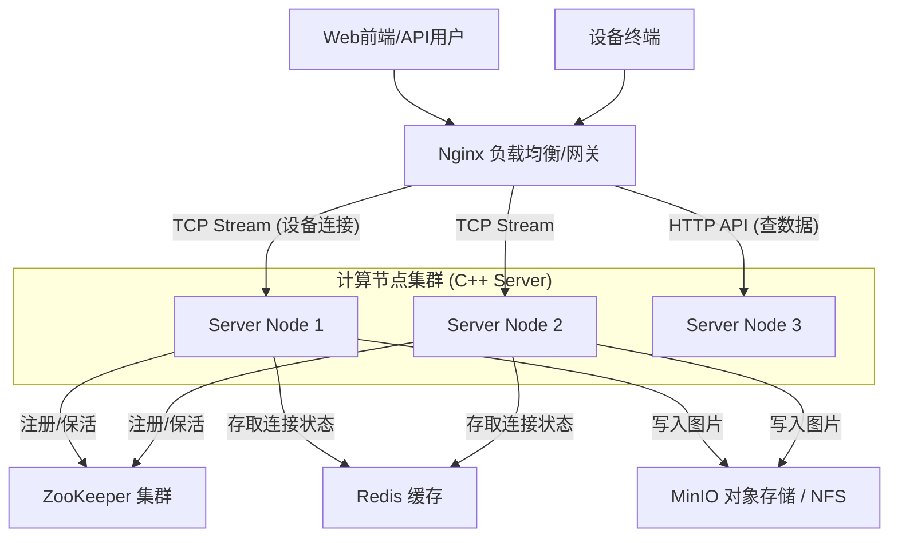

# 分布式服务器架构改造方案

## 1. 现状分析与瓶颈

当前服务器架构为 **单机 Reactor + ThreadPool**。
- **优点**：单机性能高，延迟低。
- **缺点**：
    1. **有状态连接**：TCP Socket 强绑定在当前进程，其他服务器无法向该连接发送数据。
    2. **单点故障**：进程崩溃导致所有设备断连。
    3. **存储孤岛**：图片存储在本地 `resource/uploads`，多节点间无法共享访问。
    4. **扩展受限**：受限于单机文件描述符（FD）上限和带宽。

## 2. 核心改造目标
1. **存储解耦**：所有节点能访问同一份图片数据。
2. **状态共享**：集群知道“设备ID:1001”当前连接在“节点A”上。
3. **负载均衡**：客户端连接请求能均匀分发到各节点。
4. **服务发现**：基于 **ZooKeeper** 实现节点的动态上下线。

---

## 3. 总体架构设计 (ZooKeeper + Redis + MinIO/NFS)

### 3.1 架构图


---

## 4. 详细实施步骤

### 第一阶段：存储解耦 (基础)
**目标**：解决多节点文件由于存放在本地无法被 Web 端统一访问的问题。

#### 方案 A：NFS (网络文件系统) - **最快实施**
1. 搭建一台 NFS 服务器 (或使用云厂商 NAS)。
2. 在所有计算节点挂载 NFS 到 `/home/jym/.../resource/uploads`。
3. **代码修改**：无，代码依然认为是写本地文件，操作系统层面解决共享。

#### 方案 B：MinIO (对象存储) - **并建议**
1. 部署 MinIO（兼容 S3 协议）。
2. **代码修改**：
   - 修改 `recvfile.cpp` 中的 `HandleFileEnd`。
   - 将 `std::ofstream` 写文件改为调用 `s3-cpp-sdk` 或 MinIO HTTP API 上传文件。
   - 数据库/API 返回的 URL 改为 MinIO 的 HTTP 访问地址。

---

### 第二阶段：服务注册与发现 (ZooKeeper)
**目标**：解决 "有多少个节点存活" 的问题，以及让 Nginx 或管理端能感知节点扩缩容。

#### 实施方案：
1. **引入 ZooKeeper Client (zookeeper-client-c)**。
2. **代码修改 (`ServerApp.cpp`)**：
   - **启动时**：在 ZK 的 `/gw-server/nodes/` 路径下创建一个 **临时有序节点 (Ephemeral Sequential)**。
     - 路径：`/gw-server/nodes/node_192.168.1.10_52487`
     - 数据：`{"ip": "192.168.1.10", "load": 20}` (当前连接数)
   - **运行时**：定时更新节点数据中的负载信息。
   - **停止时**：断开 ZK 连接，临时节点自动删除。

**ZooKeeper 的作用**：
- **监控中心**：可以看到当前有多少个服务节点在线。
- **高可用**：如果节点宕机，ZK 上节点消失，网关立刻感知，不再转发流量。

---

### 第三阶段：全剧连接状态管理 (Redis) - **核心难点**
**目标**：解决 "我想给设备A发指令，但不知道设备A连在哪个节点" 的问题。

#### 实施方案：
需要引入 Redis 维护 `设备ID -> 服务器节点` 的映射关系。

**代码修改**：

1. **设备上线 (`HandleHeartbeat` / `HandleFileStart`)**：
   - 当收到设备心跳或握手包并解析出 DeviceID 后。
   - Redis 执行：`SET device:online:1037001 "192.168.1.10:52487" EX 60` (设置60秒过期，心跳保活)。

2. **设备下线 (`CloseConnection`)**：
   - Redis 执行：`DEL device:online:1037001`。

3. **API 路由 (`http_server.cpp`)**：
   - 当调用 `POST /api/request_snapshot` (给设备发指令) 时：
   - **当前节点处理**：查询 Redis `GET device:online:1037001`。
   - **判断**：
     - 如果 IP 是**本机**：直接查找 `connection_manager` 获取 fd，发送指令。
     - 如果 IP 是**其他节点**：作为反向代理，将 HTTP 请求转发给目标节点的 HTTP 接口；或者返回 307 Redirect 让前端重试。

---

### 第四阶段：接入层负载均衡 (Nginx)

配置 Nginx 作为统一入口。

```nginx
# nginx.conf 示例

stream {
    upstream tcp_backend {
        # 也可以使用 nginx-zookeeper 模块实现动态 upstream
        server 192.168.1.10:52487;
        server 192.168.1.11:52487;
    }

    server {
        listen 52487;
        proxy_pass tcp_backend;
    }
}

http {
    upstream api_backend {
        server 192.168.1.10:8080;
        server 192.168.1.11:8080;
    }
    
    server {
        listen 80;
        location / {
            proxy_pass http://api_backend;
        }
    }
}
```

---

## 5. 代码改造清单 (To-Do List)

### 依赖库
- `zookeeper-client-c` (C语言 ZK 客户端)
- `hiredis` 或 `cpp_redis` (Redis 客户端)

### 1. `ServerApp` 类改造
- **增加成员**：`ZkClient zkClient; RedisClient redisClient;`
- **初始化**：连接 ZK，注册 `/gw-server/nodes/xxx`。连接 Redis。
- **析构**：注销 ZK 节点。

### 2. `recvfile.cpp` / `connection.cpp` 改造
- **OnClientRead / CloseConnection**：
  - 连接断开时，异步任务去 Redis 删除 Key。
- **HandleHeartbeat**：
  - 收到心跳时，异步任务去 Redis 刷新 Key 的过期时间 (Expire)。

### 3. `http_server.cpp` 改造
- **指令下发接口**：
  - 先查 Redis 找设备所在节点。
  - 实现一个简单的 HTTP Client (`httplib::Client`) 用于节点间转发请求。

---

## 6. 总结
如果你想从单机废弃物变成高可用架构，**Redis 是必须的**（用于定位设备），**NFS/MinIO 是必须的**（用于共享图片）。

**ZooKeeper** 是可选的，如果你的节点IP是固定的，Nginx 手写 Upstream 即可；但如果你想要类似于微服务的动态扩缩容，或者想要做一个可视化的集群监控中心，ZooKeeper 是最佳选择。
