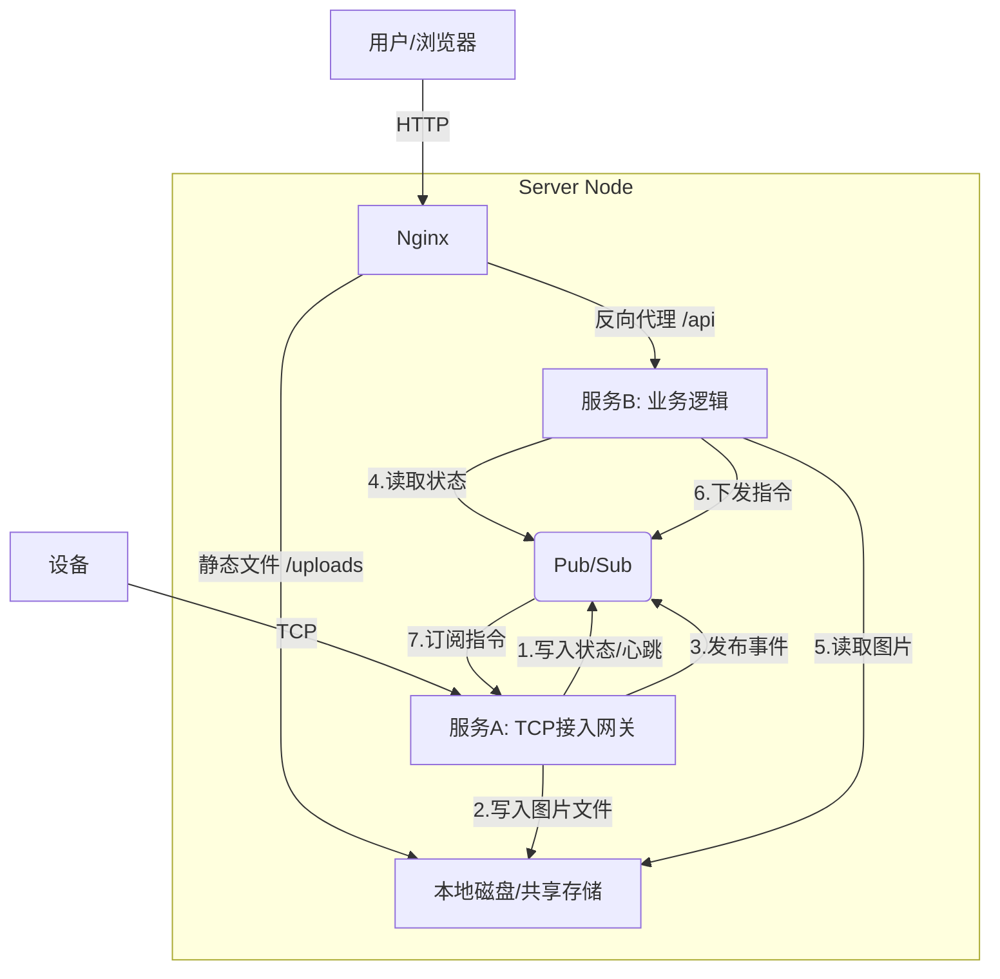

# 单体到微服务架构演进方案 (单人维护版)
微服务划分
- 设备接入 IOTGateWay 极少变更 可以用asio重写 (设备完全接入，存好图片先放在本地)
- 前端处理 可以使用python/go 无状态 可以随时重启 HTTP API （消费图片、存到mysql、上传到oss、下发指令）
- 基础设施 Redis替换connection 负责服务间的通信和状态共享 Nginx反向代理与静态资源
- 容器化部署 docker-compose

## 1. 现状评价与架构分析

### 1.1 现有单体架构 (Current Monolith)
你目前的系统是一个典型的 **"基于线程的单体 C++ 服务"**：
- **优点**：开发简单，部署方便（一个二进制文件），内存通信无延迟，调试容易。
- **缺点**：
  - **稳定性耦合**：协议解析崩溃会导致 Web 服务不可用；图片处理卡顿会阻塞心跳。
  - **扩展性差**：必须整体扩容，不能只扩容图片处理部分。
  - **技术栈绑定**：想用 Python 做 Web 或 AI 处理很麻烦，必须嵌入 C++。

### 1.2 对你提出的三个服务拆分的评价
你提议拆分为：
1. **设备连接/传图**：**非常合理**。这是系统的"接入层 (Gateway)"，负责维持长连接和协议转换。
2. **前端展示/主动要图**：**合理**。这是"业务层 (Business/Web)"，面向用户，变更最频繁。
3. **设备升级**：**建议暂不独立拆分**。升级逻辑本质上是业务层的一部分，数据下发依赖接入层。在单人维护下，独立拆分会增加不必要的 RPC 调用复杂度。建议先合并在业务层中。

---

## 2. 推荐架构方案：接入与业务分离 (Gateway-Business Pattern)

考虑到**"代码由一人维护"**且**"从简"**的原则，我不推荐引入 Kubernetes、Etcd、Grpc 等重型微服务组件。
推荐采用 **"双进程 + Redis"** 的轻量级微服务架构。

### 2.1 架构图



### 2.2 核心组件职责

#### **服务 A：IoT Gateway (C++) - 改造自现有 Server**
- **职责**：
  - 监听 TCP 端口 (52487)，维护 Socket 长连接。
  - 协议编解码 (B351, B342, B38 等)。
  - **心跳保活**：收到心跳后，将设备在线状态写入 Redis (SET device:1037... online EX 60)。
  - **图片接收**：接收图片流，直接落盘到共享目录，然后向 Redis 发布 "NewImage" 事件。
  - **指令执行**：订阅 Redis 的 "DeviceCmd" 频道，收到 Web 发来的指令（如要图、升级）后，通过 Socket 发送给设备。
- **特点**：高性能，极少变更，甚至可以用 libevent/asio 重写。

#### **服务 B：Business Web (推荐 Python/Go，也可沿用 C++)**
- **职责**：
  - 提供 HTTP API (/api/images, /api/devices, /upload)。
  - **状态查询**：不直接查内存，而是查 Redis 获取设备列表。
  - **主动要图**：用户点击按钮 -> Web 服务向 Redis 发布 "DeviceCmd" 消息 -> Gateway 收到后执行。
  - **图片管理**：读取磁盘文件，生成缩略图，返回给 Nginx 或用户。
- **特点**：变更频繁，逻辑复杂，无状态（State-less），可随时重启。

#### **基础设施**
- **Redis**：系统的"神经中枢"，负责服务间通信和状态共享。
- **Nginx**：负责静态资源 (HTML/JS/图片) 托管和 API 反向代理。

---

## 3. 从现有代码到微服务的改造实施步骤

### 阶段一：数据解耦 (引入 Redis)
**目标**：移除 C++ 中的 `connection_manager` 全局内存依赖，改用 Redis 存储设备状态。

1.  **环境准备**：
    -   安装 Redis：`apt install redis-server`
    -   C++ 引入 Redis 客户端库：推荐 `hiredis` 或 `redis-plus-plus`。

2.  **代码修改 (Gateway)**：
    -   在 `HeartbeatHandler` 中，不再只是 `ctx->setDeviceId`，而是同步执行 `redis.setex("device:"+id, 60, fd)`。
    -   在 `RecvFileHandler` 图片接收完毕后，不再直接调 HTTP 接口，而是 `redis.publish("new_image", "{channel:1, file:'...'}")`。

3.  **代码修改 (Web)**：
    -   `/api/devices` 接口改为扫描 Redis 中的 `device:*` 键。
    -   `/api/connections` 改为从 Redis 获取信息。

### 阶段二：进程拆分 (Split Processes)
**目标**：将 HTTP 服务与 TCP 服务拆分为两个独立进程。

1.  **拆分 Gateway**：
    -   保留 `main.cpp`, `recvfile.cpp`, `connection.cpp`。
    -   **删除** `http_server.cpp` 相关代码。
    -   新增一个后台线程 `SubscribeThread`，订阅 Redis 的 `cmd_channel`。当收到 `{cmd: "get_image", device: "...", channel: 1}` 时，查找本地 FD，调用 `SendProtocolB341`。

2.  **拆分 Web Service**：
    -   新建一个项目（建议用 Python FastAPI 或 Go Gin，开发效率高十倍）。
    -   实现原有的 `/api/*` 接口。
    -   实现"主动要图"逻辑：收到 HTTP 请求 -> Publish Redis 消息。

3.  **配置 Nginx**：
    -   配置 Nginx 代理：
        -   `location /` -> 静态文件目录
        -   `location /api` -> `http://localhost:8000` (Web Service)
        -   `location /uploads` -> 本地图片目录

### 阶段三：容器化与部署 (Dockerization)
**目标**：一键部署，环境隔离。

1.  编写 `docker-compose.yml`：
    ```yaml
    version: '3'
    services:
      redis:
        image: redis:alpine
      gateway:
        build: ./server-gateway
        volumes:
          - ./uploads:/app/uploads
        ports:
          - "52487:52487"
      web:
        build: ./server-web
        volumes:
          - ./uploads:/app/uploads
        environment:
          - REDIS_HOST=redis
    ```

---

## 4. 具体代码修改点参考

### 4.1 Gateway 订阅指令 (C++ 伪代码)
在 Gateway 中新增线程处理 Web 发来的指令：

```cpp
// 伪代码：Gateway 监听 Redis 指令
void RedisSubThread() {
    auto redis = RedisConnect("127.0.0.1", 6379);
    redis.subscribe("device_commands", [](string msg) {
        // msg: {"target_device": "1037...", "cmd": "capture", "channel": 1}
        auto json = parse(msg);
        string devId = json["target_device"];
        
        // 查找本地连接
        int fd = FindFdByDeviceId(devId); 
        if (fd > 0) {
            SendProtocolB341(fd, json["channel"]);
        }
    });
}
```

### 4.2 Web 主动要图 (Python 伪代码)
如果你决定用 Python 重写 Web 层（推荐）：

```python
# FastAPI 示例
@app.post("/api/capture")
def capture_image(device_id: str, channel: int):
    # 检查设备是否在线 (查 Redis)
    if not redis.exists(f"device:{device_id}"):
        return {"error": "Device offline"}
    
    # 发送指令给 Gateway
    message = json.dumps({"target_device": device_id, "cmd": "capture", "channel": channel})
    redis.publish("device_commands", message)
    return {"status": "command_sent"}
```

## 5. 总结

| 维度 | 单体 (现状) | 微服务 (改造后) |
| :--- | :--- | :--- |
| **稳定性** | 协议解析挂 -> Web 挂 | 协议挂 -> Web 正常；Web 挂 -> 设备连接正常 |
| **开发效率** | C++ 写业务慢，编译慢 | 核心用 C++，业务用 Python/Go，效率极高 |
| **维护成本** | 低 (1个进程) | 中 (2个进程 + Redis) |
| **扩展性** | 差 | 好 (Gateway 和 Web 可分别扩容) |

**建议路线**：
不要一步到位。先引入 **Redis** 替换内存 Map，保持单进程运行；跑通后再把 HTTP 服务代码剥离出去成为独立进程。这样风险最小。
